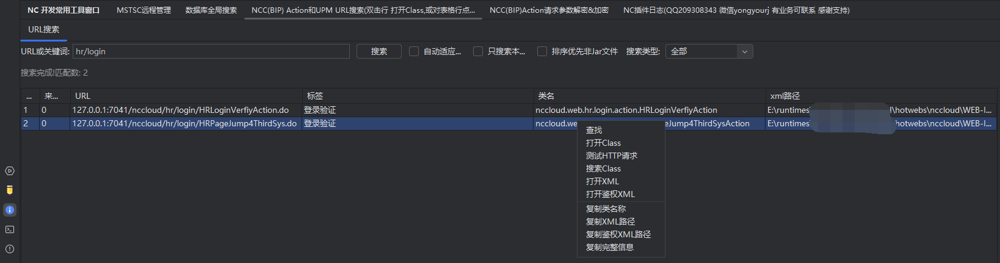

# 简介

用友 Yonyou NC5系列 、 U8Cloud、 NC6系列 、 NCCloud 、 YonBIP Idea devtool Plugin   
实现了 Idea Yonyou NC5x 、 U8Cloud 、 NC6x 、 NCCloud(新版改名叫YonBip) 、 YonBIP 开发插件。            

## 注意，最新的插件安装包是 项目根目录的 idea_plugin_ncdevplugin文件名开头的 7z文件！ 安装需要 下载这个7z文件后解压，里面是个zip，直接安装这个zip即可！
  如果有多个 就都下载下来，加压，因为git限制文件大小，所以我可能会压缩zip成为 多个拆分大小的7z文件。
  如果没有7z 那就是 项目根目录的 几十MB大小的那个 zip 文件 。

# 插件使用视频教程
<a href="https://www.bilibili.com/video/BV1mg4y1f7cQ/?vd_source=6b1c74e795e65a8b04ffe9fe91867a10">
使用教程:  https://www.bilibili.com/video/BV1mg4y1f7cQ/?vd_source=6b1c74e795e65a8b04ffe9fe91867a10 <a/>

# 因本人目前在微服务公司，所以本人业余接开发私单，有私单才能继续参与NC 继续更新插件
## 专业承接 U8C NC5 NC6 NCC BIP，java微服务，前后端分离，小程序 H5APP 等等私活， ncc这些开发都是用友高级以上认证，项目都是100家以上经验！      每年至少会做10家以上私单项目！                    
## 业务联系方式: QQ 209308343   微信： yongyourj                  
# 交个朋友，支持一杯咖啡:
     

# 插件截图





# 使用方式

插件安装后使用方式:

```txt
新建项目-必须步骤：
1. Tools -> 配置NC HOME   进行NC HOME配置！ 
2. Tools -> 更新NC 库依赖 执行依赖更新! (第一步如果自动配置了 就不用再点，如果切换了home或者home里代码文件变动了 要在点一下更新)
3. Tools -> 生成默认NC运行配置!(如果重启IDEA后丢失了运行配置或者改了HOME 再次执行这个)    
4. 如果不想自己配置项目结构和新建src这些文件夹，可以在模块上右键 点击 重新配置模块结构
5. 如果有特殊需求可以直接修改 .idea文件夹里的 nc.properties 文件里配置内容，重启idea生效。
```

```text
add-idea连接数据库导出sql脚本增加xml支持变量填充!! 参考文件： 参考配置文件/导出脚本配置参考-一个单据比如/items_p7_单据模板.xml
```


导出补丁支持 模块写一个配置文件 自定义相对路径：
```properties
#本文件必须放入模块的根目录 文件名： patcherconfig.properties   
#文件用法(可参考示例文件 patcherconfig.properties 所有参数都可以配或不配置 插件有默认值的哈)：   
# class全限定名=相对路径(也就是NC模块名字)   
#例子(对test无效)：    
nc.ui.gl.AddVoucherLineAction=gl   
# 支持包路径比如:    
nc.ui.gl=gl2       
nc.ui=gl3       
#  会根据 包路径判断模块名字，优先级是 全路径》包路径(包路径从最末级逐个向上匹配)》模块猜测       
# 特殊参数：   
##是否不要test代码，默认true
config-notest=false         
##是否导出源代码，默认true
config-exportsourcefile=true         
##是否把代码打包成jar文件， 默认false    
config-compressjar=false        
##如果启用了代码打包成jar文件，是否删除class文件  默认false
config-compressEndDeleteClass
##如果打包jar，那么 META-INF.MF 文件模板磁盘全路径(可以不配置 采用默认)  
config-ManifestFilePath=path             
#是否猜测模块，默认false，开启后 如果配置文件没有指明的类会根据包名第三个判断模块       
# （比如 nc.ui.pub.ButtonBar 第三个是pub 所以认为模块是 pub）     
config-guessModule=true     
# 类路径配置文件:     
#     比如我要把 nc.bs.arap包里 1.txt和DzTakeF1Impl.wsdl文件输出到 arap模块下的包文件夹里:   
nc.bs.arap.1.txt=arap   
nc.bs.arap.DzTakeF1Impl.wsdl=arap    
# 是否不导出 modelue.xml 默认false
not-export-modelue-xml=false     
 ```

.idea 文件夹里 nc.properties 插件项目配置信息选项说明：

```properties
#IDEA插件配置文件， 位于项目跟 .idea文件夹内
#NC的HOME根目录
home=I\:\\runtime\\NCC2105HOME
#客户端ip
clientip=127.0.0.1
#客户端端口
clientport=13100
#是否过滤重复sql
filtersql=true
#是否启用iuap默认的子表配置， 目前没实现
enableSubResultSet=true
#是否不使用iuap导出的script的SQL文件进行汇总，而是强制使用IDEA插件连接NC数据库导出SQL语句
rebuildsql=true
#IDEA如果配置的强制导出SQL， 默认的数据源索引（NC的数据源列表第几个 0开始）
data_source_index=0
#IDEA如果强制导出SQL 是否导出delete语句
includeDeletes=false
#是否关闭 NCC的hotwebs文件的实时复制
close_client_copy=false
#强制指定NC的版本 NC5, NC6,  NCC,  U8Cloud
nc.version=NCC
#是否删除hotwebs的dist 然后强行npm run build一下
reNpmBuild=true
# 是否导出前端资源 resources文件夹，默认是
exportResources=true
# 是否导出sql，默认是
exportSql=true
# 是否只保留全量sql单个文件，默认是
onleyFullSql=true
####
```

IDEA连接数据库导出SQL的xml配置文件:
```text
参考 参考配置文件中的 xml，
新增变量功能：

 <vars>
        <!--        这个可以定义这个文件范围内的变量，然后可以在下面的 标签值中 使用变量
        ， 比如 我定一个 一个变量名 billType 那么下面使用可以用 {billType} 使用他(大小写敏感)
        ，固定内置变量： date 当前日期， datetime 当前日期加时间 ， project 项目名称， module 模块名称
         -->
        <var name="appcode">40060101</var>
        <var name="user">_by 张三 {datetime} 导出应用编码：{appcode} 所属项目 {project} 代码模块 {module}</var>
 </vars>


```

# 常见问题

1. IDEA 重启后如果提示运行配置的 variables 比如 FIELD_NC_HOME 等无效，请无视他 ，因为在项目运行列表里里配置了 ，无需在 file > setting > apperarance & behavior >
   path variables 里配置全局的！

# 已知BUG

1. 注意： 如果你没有设置JAVAHOME或者ufjdk没有javap工具，导出补丁不会导出 同一个源文件内的非public类中匿名且非public的类文件。但如果有javap就会导出 但同时耗时较长！

# 未来待实现功能

1. 元数据编辑 - 暂不完成
2. WSDL新增功能 - 暂不完成

# 版本更新

``` 
<em>4.0 版本 更新:</em> <br>
      <ul>
              <li>1. 新增 根据数据库表最新数据导出BMF元数据功能！</li>
              <li>2. 优化 导出指定文件功能！</li>
      </ul>

<em>3.8 版本 更新:</em> <br>
      <ul>
          <li>1. 优化和修复部分功能</li>
          <li>2. IDEA强制连接数据库导出脚本SQL功能 新增 支持 模块\script\conf\initdata\ 下所有的.xml都会读取导出，而不是只导出items.xml和items_idea.xml</li>
      </ul>

<em>3.7 版本 更新:</em> <br>
      <ul>
          <li>1. 新增数据库全局搜索</li>
          <li>2. 新增MSTSC远程桌面管理</li>
          <li>3. 重写优化NCC的Action类和UPM的servlet搜索功能</li>
          <li>4. 大量弹框增加IDEA侧边栏界面，方便不想要弹框的用户</li>
      </ul>
      
<em>3.3 版本 更新:</em> <br>
      <ul>
          <li>1. 新增NC代码规范检查功能，可支持检查是否client private public 导包存在错误.</li>
      </ul>
      
  <em>3.1 版本 更新:</em> <br>
      <ul>
          <li>1. 支持导出补丁右侧选则只导出哪些模块或文件.</li>
          <li>2. 支持导出云管家格式补丁(
                    nc.prop配置: 
                        filtersql 是否过滤完全重复SQL语句 默认 true ,<br>
                        rebuildsql 是否无视iuap导出的SQL采用IDEA插件自动根据items.xml导出SQL 默认 false ,<br>
                        data_source_index idea导出SQL使用的数据源索引 默认 0 ,<br>
                        enableSubResultSet 是否支持iuap自带的子表导出 默认 true -此功能暂时不支持，如果用idea强制导出 那么必须手工配置子表到 items-idea.xml(和items.xml一个文件夹里)中 ,<br>
                        includeDeletes 是否导出delete删除已存在数据的语句 默认 false .<br>
                        reNpmBuild 是否强制执行npm build 默认 true .<br>
                        format4Ygj 导出云管家模式 默认 true .<br>
              )
          </li>
      </ul>
     <em>3.0 版本 更新:</em> <br>
          <ul>
              <li>1. 支持导出补丁构建成NCC特有结构(前后端，前端要自己先build好).</li>
              <li>1. 支持自动合并和过滤SQL脚本(
                        nc.prop配置: 
                            filtersql 是否过滤完全重复SQL语句 默认 true ,<br>
                            rebuildsql 是否无视iuap导出的SQL采用IDEA插件自动根据items.xml导出SQL 默认 false ,<br>
                            data_source_index idea导出SQL使用的数据源索引 默认 0 ,<br>
                            enableSubResultSet 是否支持iuap自带的子表导出 默认 true -此功能暂时不支持，如果用idea强制导出 那么必须手工配置子表到 items-idea.xml(和items.xml一个文件夹里)中 ,<br>
                            includeDeletes 是否导出delete删除已存在数据的语句 默认 false .<br>
                            reNpmBuild 是否强制执行npm build 默认 true .<br>
                  )
              </li>
          </ul>
    <em>2.5.7 版本 更新:</em> <br>
      <ul>
          <li>1. 修复部分NCC的支持性问题.</li>
      </ul>

  <em>2.5.0 版本 更新:</em> <br>
      <ul>
          <li>1. 新增强行指定NC版本: <br>
                在.idea文件夹的nc.prop文件配置 nc.version参数为 NC5, NC6,  NCC,  U8Cloud 几种即可。
           </li>
          <li>2. 增加对NCC的特殊支持(特殊的hotwebs路径和配置文件路径和补丁结构)</li>
          <li>3. 优化运行等配置的生成参数</li>
          <li>4. 定时提醒和元数据复制无法正常使用，暂不修复，用处不大</li>
          <li>5. 修复部分情况下插件报错的问题</li>
      </ul>

 <em>2.4.0 版本 更新:</em> <br>
      <ul>
          <li>1. 新增NC6x导出单据脚本功能(整合一个大佬的工具) </li>
          <li>2. 新增元数据文件复制功能(整合一个大佬的工具) </li>
      </ul>
      
    <em>2.3.0 版本 更新:</em> <br>
          <ul>
              <li>1. 新增数据源 一键添加到Database工具连接列表功能 </li>
              <li>2. 新增重置NC操作员密码功能 </li>
              <li>3. 新增一键查看数据源列表和密码功能</li>
          </ul>
    
         <em>2.2.1 版本 更新:</em> <br>
          <ul>
              <li>1. 优化部分代码,减少插件直接爆出错误信息</li>
              <li>2. 修复部分小错误</li>
              <li>3. 修复 U8Cloud部分功能无法使用</li>
          </ul>
    
        <em>2.2.0 版本 更新:</em> <br>
          <ul>
              <li>1. 优化部分代码,减少插件直接爆出错误信息</li>
              <li>2. 新增 统一日志窗口，部分界面 不在使用右下角弹框</li>
              <li>3. 修复 U8Cloud部分功能无法使用</li>
              <li>4. 新增意见生成VO的set方法用</li>
              <li>5. 修复 U8Cloud部分功能无法使用</li>
          </ul>
    
        <em>2.1.1 版本 更新:</em> <br>
          <ul>
              <li>1. 新增 文件夹转jar功能</li>
              <li>2. 新增 NC补丁class模块转jar功能</li>
          </ul>
    
          <em>2.1.0 版本 更新:</em> <br>
          <ul>
              <li>1. 不修改NC本身数据源配置文件prop.xml</li>
              <li>2. 生成运行配置会生成模块的补丁导出配置文件。</li>
              <li>3. 修复打包成Jar Jar文件异常 无法识别。</li>
              <li>4. 增加部分导出补丁的配置参数。</li>
              <li>5. 导出补丁的支持包路径配置。</li>
          </ul>
    
          <em>2.0 版本重大更新:</em> <br>
          <ul>
              <li>1. 优化大量代码</li>
              <li>2. 支持IDEA同时打开多个项目 区分当前按钮点击所在项目。</li>
              <li>3. 修复IDEA同时打开多个项目 ,每次配置文件打开自动加载新的项目插件配置文件。</li>
          </ul>
```

# 版本兼容性 
V2以及以下版本 兼容IDEA2017-2023 (IDEA 本身支持JDK5及以后)            
V3以及以上版本 兼容IDEA2021-2023 (IDEA 本身支持JDK7及以后)                       
老版本的下载，见根目录 idea_plugin_ncdevplugin.zip 里的提交历史 下载历史文件即可！           

如果你用的是BIP，启动服务有问题 可以参数修改JVM参数：          
````text        
-Djavax.xml.parsers.DocumentBuilderFactory=com.sun.org.apache.xerces.internal.jaxp.DocumentBuilderFactoryImpl           
-Djavax.xml.parsers.SAXParserFactory=com.sun.org.apache.xerces.internal.jaxp.SAXParserFactoryImpl       
````

检查NC代码规范因为需要全局扫描会比较慢，没反应就多点几次检查就好了。


# 感谢

部分代码 参考或使用了 部分插件开源项目的代码和功能灵感设计。 涉及到的有(列表可能不全，请谅解，实际已源码和项目为准)： IDEA plugin 官方示例项目 或 开源插件：
比如 https://github.com/SonarSource/sonarlint-intellij , https://github.com/gejun123456/intellij-generateAllSetMethod
,https://github.com/jshiell/checkstyle-idea 等 框架比如 guava hutool 小乖乖 等等 再次感谢开源项目参与者们的无私奉献！

#### 备注

IDEA常见事件: 事件分发 com.intellij.util.messages.impl.MessageBusImpl.invokeListener

```text
   Build Manager   com.intellij.compiler.server.BuildManagerListener                                         
   compilation status        com.intellij.openapi.compiler.CompilationStatusListener                  
Run Content      com.intellij.execution.ui.RunContentWithExecutorListener                       

```

事件断点一些不需要的:

```text

!"IdePerformanceListener".equals(message.getTopic().getDisplayName()) 
&& !"Application activation notifications".equals(message.getTopic().getDisplayName())
&& !"FrameStateListener".equals(message.getTopic().getDisplayName())
&& !"action changes".equals(message.getTopic().getDisplayName())
        && !"Document load, save and reload events".equals(message.getTopic().getDisplayName())   
        && !"tool window events".equals(message.getTopic().getDisplayName())
        && !"services topic".equals(message.getTopic().getDisplayName()) 
        && !"configuration executed".equals(message.getTopic().getDisplayName())  
        && !"IdeStatusBar.Text".equals(message.getTopic().getDisplayName())
        && !"compilation status".equals(message.getTopic().getDisplayName())
        && !"custom builder message".equals(message.getTopic().getDisplayName())
&& !"Build Manager".equals(message.getTopic().getDisplayName())
&& !"LOG_MODEL_CHANGED".equals(message.getTopic().getDisplayName())
&& !"Notifications".equals(message.getTopic().getDisplayName())
&& !"NewVirtualFileSystem changes".equals(message.getTopic().getDisplayName())
&& !"Run Content".equals(message.getTopic().getDisplayName())
&& !"DebuggerManagerListener".equals(message.getTopic().getDisplayName())
&& !"NewVirtualFileSystem changes".equals(message.getTopic().getDisplayName())


```


