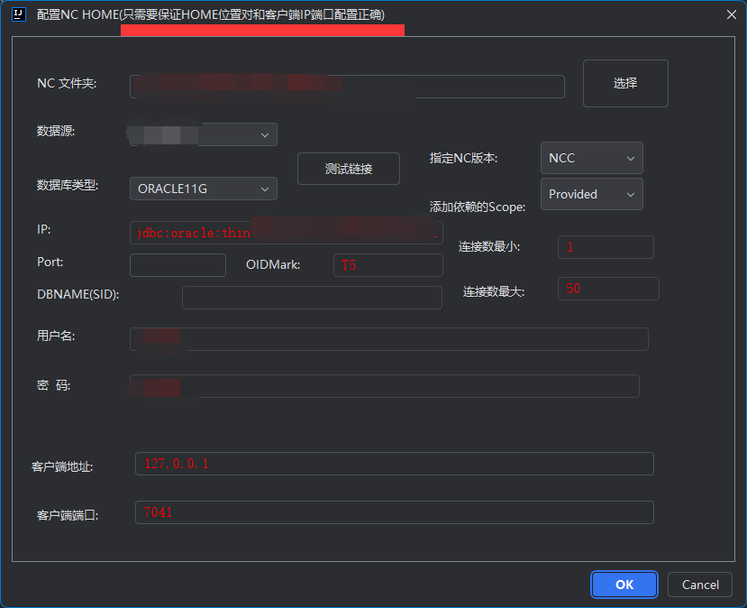

# idea_plugin_nc5devplugin
Yonyou NC5x or U8Cloud or NC6x or NCCloud or YonBIP Idea devtool Plugin   
实现了 Idea Yonyou NC5x or U8Cloud or NC6x or NCCloud(新版改名叫YonBip) or YonBIP 开发插件。

# 注意，因为本人懒等原因，最新的插件是 项目根目录的 zip文件哦，不是发行版里的哦！！！！

# 因本人目前在微服务公司，所以本人业余接开发私单，有私单才能继续参与NC 继续更新插件啊，人懒又要养家

# buy me a coffee:     
     

# 插件截图
 
    

    

    

  
  
  
    
   
     
# 使用方式
插件安装后使用方式:
```
第一次新建项目-必须步骤：
1. Tools -> 配置NC HOME   进行NC HOME配置！ 
2. Tools -> 更新NC 库依赖 执行依赖更新! 
3. Tools -> 生成默认NC运行配置!(如果重启IDEA后丢失了运行配置 可以再次执行这个)    
4. 第一次执行上面步骤以后，会生成项目默认的client public private test 几个源文件夹 请手工在 项目结构修改几个文件夹的IDEA属性为正确值
5. 请注意 模块的编译输出路径要选 use module path 分别设置test和非test class输出路径。
```
  

 导出补丁支持 模块写一个配置文件 自定义相对路径：     
 ```
  本文件必须放入模块的根目录 文件名： patcherconfig.properties   
  文件用法(可参考示例文件 patcherconfig.properties 所有参数都可以配或不配置 插件有默认值的哈)：   
  
    class全限定名=相对路径(也就是NC模块名字)   
    例子(对test无效)：    
    nc.ui.gl.AddVoucherLineAction=gl   
    
    支持包路径比如:    
    nc.ui.gl=gl2       
    nc.ui=gl3       
    会根据 包路径判断模块名字，优先级是 全路径》包路径(包路径从最末级逐个向上匹配)》模块猜测       
    
    特殊参数：   
    ##是否不要test代码，默认true
    config-notest=false         
    ##是否导出源代码，默认true
    config-exportsourcefile=true         
    ##是否把代码打包成jar文件， 默认false    
    config-compressjar=false        
    ##如果启用了代码打包成jar文件，是否删除class文件  默认false
    config-compressEndDeleteClass      
    ##如果打包jar，那么 META-INF.MF 文件模板磁盘全路径(可以不配置 采用默认)  
    config-ManifestFilePath=path             
    #是否猜测模块，默认false，开启后 如果配置文件没有指明的类会根据包名第三个判断模块       
    # （比如 nc.ui.pub.ButtonBar 第三个是pub 所以认为模块是 pub）     
    config-guessModule=true     
    类路径配置文件:     
        比如我要把 nc.bs.arap包里 1.txt和DzTakeF1Impl.wsdl文件输出到 arap模块下的包文件夹里:   
                                        nc.bs.arap.1.txt=arap   
        nc.bs.arap.DzTakeF1Impl.wsdl=arap    
 ```

.idea文件夹里 nc.properties 插件项目配置信息选项说明：
```properties
#### 是否过滤SQL
filtersql=true
#### 是否启用子查询结果生成SQL
enableSubResultSet=true
### 强制生成SQL 要用的第几个数据源
data_source_index=0
#### 客户端ip
clientip=127.0.0.1
#### 是否管理 自动复制ncc客户端文件到NChome
close_client_copy=false
#### 是否强制链接数据库 导出SQL
rebuildsql=false
#### 客户端端口
clientport=13100
#### NChome 路径
home=I\:\\runtime\\NCC2105HOME
### 强制指定nc版本
nc.version=NCC
############ 是否启用 编译后 理解进行NC代码规范检查
buildAfterNCCodeCheck=false
###### 导出补丁格式 采用云管家格式，默认true
format4Ygj=true
####
```

# 常见问题
1. IDEA 重启后如果提示运行配置的
    variables 比如 FIELD_NC_HOME 等无效，请无视他
    ，因为在项目运行列表里里配置了
    ，无需在 file > setting > apperarance & behavior > path variables 里配置全局的！    


# 已知BUG
1. 注意： 如果你没有设置JAVAHOME或者ufjdk没有javap工具，导出补丁不会导出 同一个源文件内的非public类中匿名且非public的类文件。但如果有javap就会导出 但同时耗时较长！    
# 未来待实现功能
1. 元数据编辑 - 暂不完成
2. WSDL新增功能  - 暂不完成

# 版本更新
``` 
  <em>3.1 版本 更新:</em> <br>
      <ul>
          <li>1. 支持导出补丁右侧选则只导出哪些模块或文件.</li>
          <li>2. 支持导出云管家格式补丁(
                    nc.prop配置: 
                        filtersql 是否过滤完全重复SQL语句 默认 true ,<br>
                        rebuildsql 是否无视iuap导出的SQL采用IDEA插件自动根据items.xml导出SQL 默认 false ,<br>
                        data_source_index idea导出SQL使用的数据源索引 默认 0 ,<br>
                        enableSubResultSet 是否支持iuap自带的子表导出 默认 true -此功能暂时不支持，如果用idea强制导出 那么必须手工配置子表到 items-idea.xml(和items.xml一个文件夹里)中 ,<br>
                        includeDeletes 是否导出delete删除已存在数据的语句 默认 false .<br>
                        reNpmBuild 是否强制执行npm build 默认 true .<br>
                        format4Ygj 导出云管家模式 默认 true .<br>
              )
          </li>
      </ul>
     <em>3.0 版本 更新:</em> <br>
          <ul>
              <li>1. 支持导出补丁构建成NCC特有结构(前后端，前端要自己先build好).</li>
              <li>1. 支持自动合并和过滤SQL脚本(
                        nc.prop配置: 
                            filtersql 是否过滤完全重复SQL语句 默认 true ,<br>
                            rebuildsql 是否无视iuap导出的SQL采用IDEA插件自动根据items.xml导出SQL 默认 false ,<br>
                            data_source_index idea导出SQL使用的数据源索引 默认 0 ,<br>
                            enableSubResultSet 是否支持iuap自带的子表导出 默认 true -此功能暂时不支持，如果用idea强制导出 那么必须手工配置子表到 items-idea.xml(和items.xml一个文件夹里)中 ,<br>
                            includeDeletes 是否导出delete删除已存在数据的语句 默认 false .<br>
                            reNpmBuild 是否强制执行npm build 默认 true .<br>
                  )
              </li>
          </ul>
    <em>2.5.7 版本 更新:</em> <br>
      <ul>
          <li>1. 修复部分NCC的支持性问题.</li>
      </ul>

  <em>2.5.0 版本 更新:</em> <br>
      <ul>
          <li>1. 新增强行指定NC版本: <br>
                在.idea文件夹的nc.prop文件配置 nc.version参数为 NC5, NC6,  NCC,  U8Cloud 几种即可。
           </li>
          <li>2. 增加对NCC的特殊支持(特殊的hotwebs路径和配置文件路径和补丁结构)</li>
          <li>3. 优化运行等配置的生成参数</li>
          <li>4. 定时提醒和元数据复制无法正常使用，暂不修复，用处不大</li>
          <li>5. 修复部分情况下插件报错的问题</li>
      </ul>

 <em>2.4.0 版本 更新:</em> <br>
      <ul>
          <li>1. 新增NC6x导出单据脚本功能(整合一个大佬的工具) </li>
          <li>2. 新增元数据文件复制功能(整合一个大佬的工具) </li>
      </ul>
      
    <em>2.3.0 版本 更新:</em> <br>
          <ul>
              <li>1. 新增数据源 一键添加到Database工具连接列表功能 </li>
              <li>2. 新增重置NC操作员密码功能 </li>
              <li>3. 新增一键查看数据源列表和密码功能</li>
          </ul>
    
         <em>2.2.1 版本 更新:</em> <br>
          <ul>
              <li>1. 优化部分代码,减少插件直接爆出错误信息</li>
              <li>2. 修复部分小错误</li>
              <li>3. 修复 U8Cloud部分功能无法使用</li>
          </ul>
    
        <em>2.2.0 版本 更新:</em> <br>
          <ul>
              <li>1. 优化部分代码,减少插件直接爆出错误信息</li>
              <li>2. 新增 统一日志窗口，部分界面 不在使用右下角弹框</li>
              <li>3. 修复 U8Cloud部分功能无法使用</li>
              <li>4. 新增意见生成VO的set方法用</li>
              <li>5. 修复 U8Cloud部分功能无法使用</li>
          </ul>
    
        <em>2.1.1 版本 更新:</em> <br>
          <ul>
              <li>1. 新增 文件夹转jar功能</li>
              <li>2. 新增 NC补丁class模块转jar功能</li>
          </ul>
    
          <em>2.1.0 版本 更新:</em> <br>
          <ul>
              <li>1. 不修改NC本身数据源配置文件prop.xml</li>
              <li>2. 生成运行配置会生成模块的补丁导出配置文件。</li>
              <li>3. 修复打包成Jar Jar文件异常 无法识别。</li>
              <li>4. 增加部分导出补丁的配置参数。</li>
              <li>5. 导出补丁的支持包路径配置。</li>
          </ul>
    
          <em>2.0 版本重大更新:</em> <br>
          <ul>
              <li>1. 优化大量代码</li>
              <li>2. 支持IDEA同时打开多个项目 区分当前按钮点击所在项目。</li>
              <li>3. 修复IDEA同时打开多个项目 ,每次配置文件打开自动加载新的项目插件配置文件。</li>
          </ul>
```


# 感谢
部分代码 参考或使用了 部分插件开源项目的代码和功能灵感设计。
涉及到的有(列表可能不全，请谅解，实际已源码和项目为准)：
IDEA plugin 官方示例项目 或 开源插件：
比如 https://github.com/SonarSource/sonarlint-intellij , https://github.com/gejun123456/intellij-generateAllSetMethod  等
框架比如 guava hutool 小乖乖 等等
再次感谢开源项目参与者们的无私奉献！


#### 备注
IDEA常见事件: 事件分发 com.intellij.util.messages.impl.MessageBusImpl.invokeListener                    
```text
   Build Manager   com.intellij.compiler.server.BuildManagerListener                                         
   compilation status        com.intellij.openapi.compiler.CompilationStatusListener                  
Run Content      com.intellij.execution.ui.RunContentWithExecutorListener                       

```
事件断点一些不需要的:
```text

!"IdePerformanceListener".equals(message.getTopic().getDisplayName()) 
&& !"Application activation notifications".equals(message.getTopic().getDisplayName())
&& !"FrameStateListener".equals(message.getTopic().getDisplayName())
&& !"action changes".equals(message.getTopic().getDisplayName())
        && !"Document load, save and reload events".equals(message.getTopic().getDisplayName())   
        && !"tool window events".equals(message.getTopic().getDisplayName())
        && !"services topic".equals(message.getTopic().getDisplayName()) 
        && !"configuration executed".equals(message.getTopic().getDisplayName())  
        && !"IdeStatusBar.Text".equals(message.getTopic().getDisplayName())
        && !"compilation status".equals(message.getTopic().getDisplayName())
        && !"custom builder message".equals(message.getTopic().getDisplayName())
&& !"Build Manager".equals(message.getTopic().getDisplayName())
&& !"LOG_MODEL_CHANGED".equals(message.getTopic().getDisplayName())
&& !"Notifications".equals(message.getTopic().getDisplayName())
&& !"NewVirtualFileSystem changes".equals(message.getTopic().getDisplayName())
&& !"Run Content".equals(message.getTopic().getDisplayName())
&& !"DebuggerManagerListener".equals(message.getTopic().getDisplayName())
&& !"NewVirtualFileSystem changes".equals(message.getTopic().getDisplayName())


```


